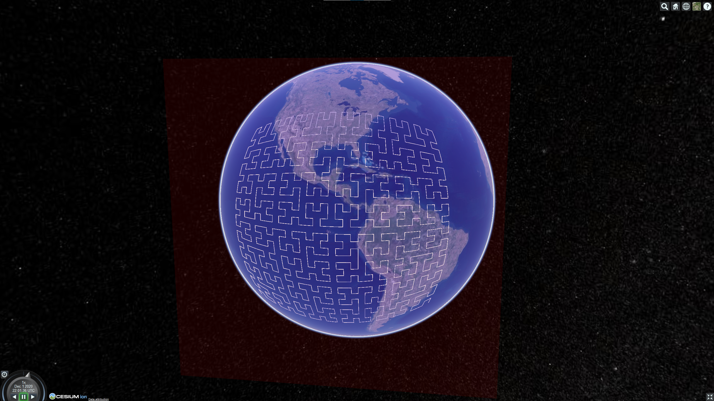

# 3DTILES_bounding_volume_S2

## Contributors

- Sam Suhag, Cesium
- Sean Lilley, Cesium

## Status

Draft

## Dependencies

Written against the 3D Tiles 1.0 spec.

## Contents

- [Overview](#overview)
- [Coordinate System Conversion](#coordinate-system-conversion)

## Overview

This extension to 3D Tiles enables using an [S2Cell](http://s2geometry.io/devguide/s2cell_hierarchy) as a bounding volume for a tile.

The S2 Geometry library provides a method of spatially organizing a data over a sphere, using quadrilateral sphere mapping to project from a cube to the sphere. On the cube, space can be divided trivially into a quadtree and that uniform size of the tiles is retained on the sphere, using the curvilinear transform applied to the gnomonic projection.

| S2 Curve on Cube  |  S2 Curve on WGS84 Ellipsoid |
|---|---|
|   |   |

## Coordinate System Conversion

The following diagram illustrates the system to convert from `S2CellID` to a bounded region on the WGS84 ellipsoid:

## Bounding Heights

The elements at index 2 and 3 in the `s2cell` array specify the minimum and maximum heights for the bounding volume of the tile. The heights are specified in meters above the WGS84 ellipsoid.

## Subdivision

The S2Geometry library uses the Hilbert surface filling curve to map a 2D array into a 1D array. The curve increases in granularity with each successive level of detail. Each tile subdivides into a 4 smaller tiles. When the `quadtree` tiling scheme is used, the bounding volume subdivides into these 4 tiles retaining the same bounding heights. When the `octree` tiling scheme is used, the bounding volume of the tile subdivides into these 4 tiles, with an additional split at the midpoint of the bounding heights, yielding 8 children tiles.

## Schema Changes

The changes to the schema can documented in [extension.schema.json](schema/extension.schema.json).