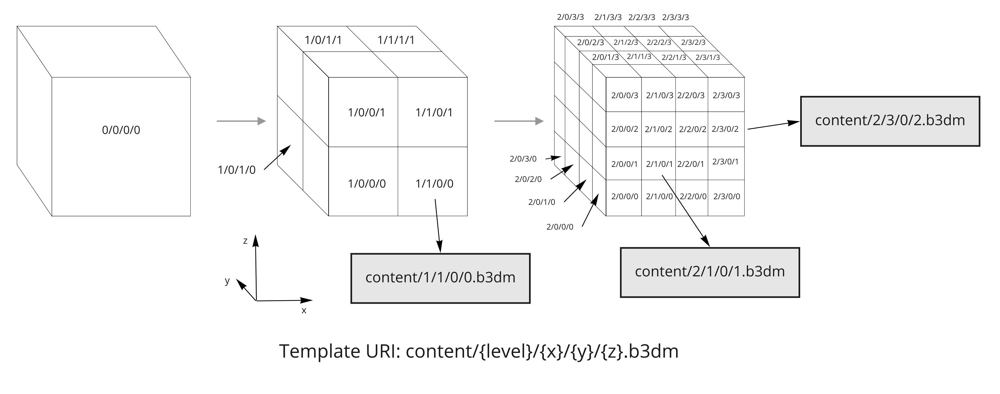
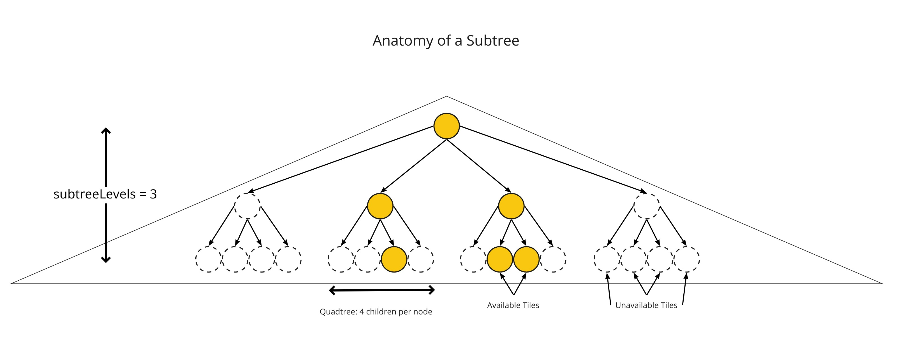
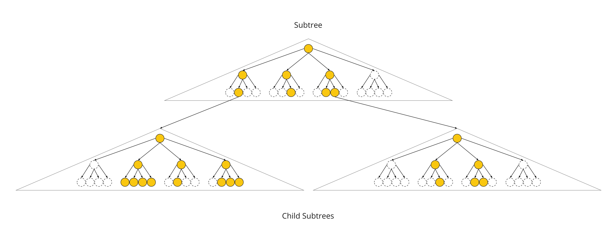
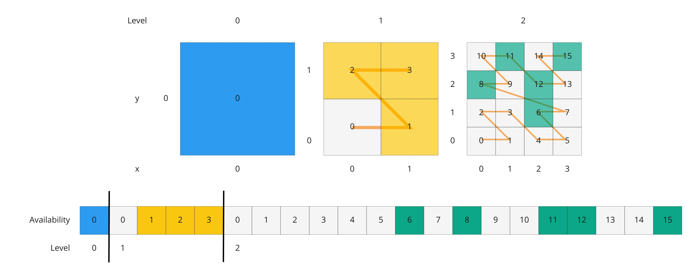
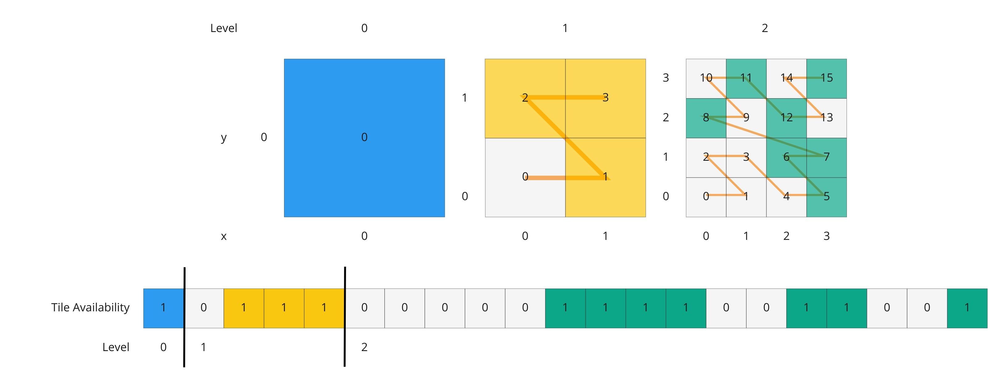
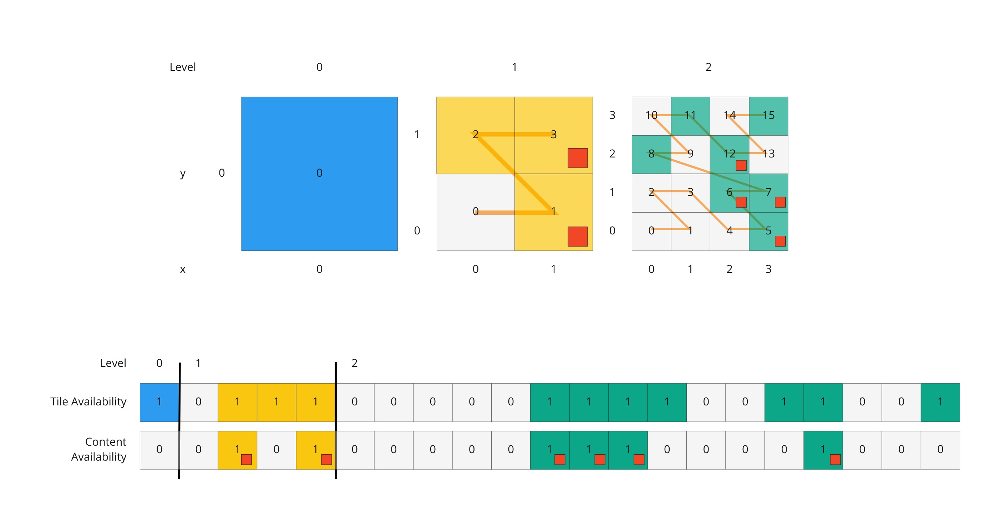
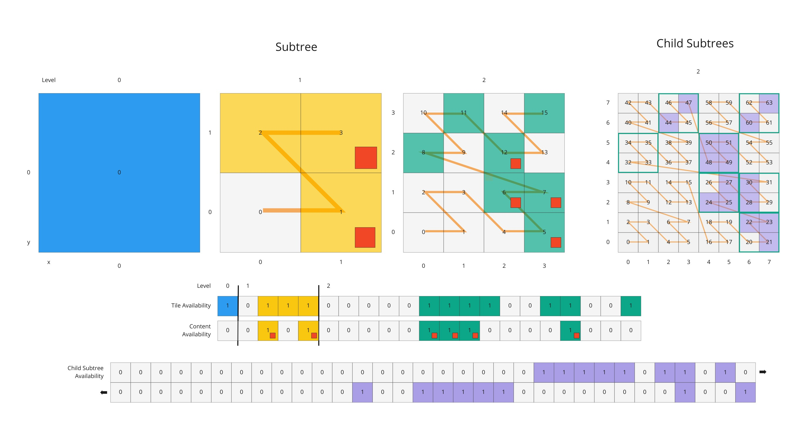
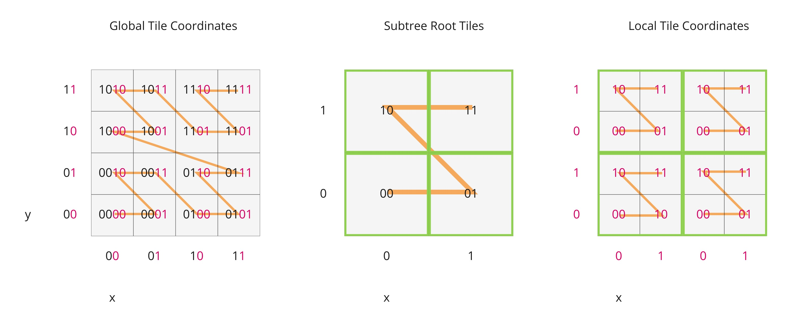
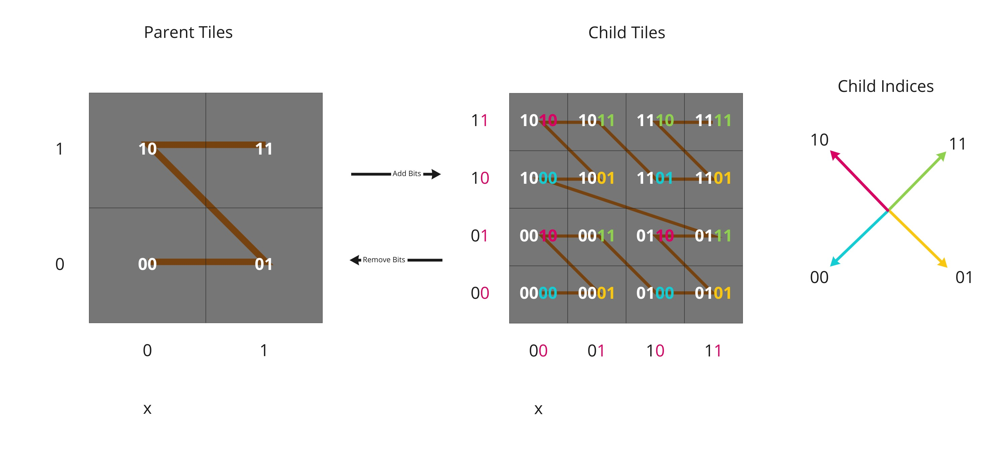

<!-- omit in toc -->
# 3DTILES_implicit_tiling

**Version 0.0.0**, TODO: Date

<!-- omit in toc -->
## Contributors

* Peter Gagliardi, Cesium
* Erixen Cruz, Cesium
* Sam Suhag, Cesium
* Sean Lilley, Cesium
* Josh Lawrence, Cesium
* Patrick Cozzi, Cesium
* Shehzan Mohammed, Cesium

<!-- omit in toc -->
## Status

Draft

<!-- omit in toc -->
## Dependencies

Written against the 3D Tiles 1.0 specification.

<!-- omit in toc -->
## Optional vs. Required

This extension is required, meaning that it must be listed in
both the `extensionsUsed` and `extensionsRequired` arrays of the
tileset JSON.

<!-- omit in toc -->
## Contents

- [Overview](#overview)
- [Use Cases](#use-cases)
- [Tileset JSON](#tileset-json)
- [Subdivision scheme](#subdivision-scheme)
  - [Implicit Subdivision](#implicit-subdivision)
- [Tile Coordinates](#tile-coordinates)
- [Template URIs](#template-uris)
- [Subtrees](#subtrees)
  - [Availability](#availability)
  - [Tile Availability](#tile-availability)
  - [Content Availability](#content-availability)
  - [Child Subtree Availability](#child-subtree-availability)
- [Subtree Files](#subtree-files)
  - [Buffers and Buffer Views](#buffers-and-buffer-views)
  - [Availability Packing](#availability-packing)
- [Glossary](#glossary)
- [Examples](#examples)
- [Extension JSON Schema Reference](#extension-json-schema-reference)
  - [3DTILES_implicit_tiling tile extension](#3dtiles_implicit_tiling-tile-extension)
    - [3DTILES_implicit_tiling tile extension.subdivisionScheme](#3dtiles_implicit_tiling-tile-extensionsubdivisionscheme)
    - [3DTILES_implicit_tiling tile extension.subtreeLevels](#3dtiles_implicit_tiling-tile-extensionsubtreelevels)
    - [3DTILES_implicit_tiling tile extension.maximumLevel](#3dtiles_implicit_tiling-tile-extensionmaximumlevel)
    - [3DTILES_implicit_tiling tile extension.subtrees](#3dtiles_implicit_tiling-tile-extensionsubtrees)
    - [3DTILES_implicit_tiling tile extension.extensions](#3dtiles_implicit_tiling-tile-extensionextensions)
    - [3DTILES_implicit_tiling tile extension.extras](#3dtiles_implicit_tiling-tile-extensionextras)
  - [Subtree](#subtree)
    - [tile.3DTILES_implicit_tiling.subtree.uri](#tile3dtiles_implicit_tilingsubtreeuri)
    - [tile.3DTILES_implicit_tiling.subtree.extensions](#tile3dtiles_implicit_tilingsubtreeextensions)
    - [tile.3DTILES_implicit_tiling.subtree.extras](#tile3dtiles_implicit_tilingsubtreeextras)
  - [Template URI](#template-uri)
- [Subtree JSON Schema Reference](#subtree-json-schema-reference)
  - [Availability](#availability-1)
    - [availability.bufferView](#availabilitybufferview)
    - [availability.availableCount](#availabilityavailablecount)
    - [availability.constant](#availabilityconstant)
    - [availability.extensions](#availabilityextensions)
    - [availability.extras](#availabilityextras)
  - [Buffer](#buffer)
    - [buffer.uri](#bufferuri)
    - [buffer.byteLength](#bufferbytelength)
    - [buffer.name](#buffername)
    - [buffer.extensions](#bufferextensions)
    - [buffer.extras](#bufferextras)
  - [Buffer View](#buffer-view)
    - [bufferView.buffer](#bufferviewbuffer)
    - [bufferView.byteOffset](#bufferviewbyteoffset)
    - [bufferView.byteLength](#bufferviewbytelength)
    - [bufferView.name](#bufferviewname)
    - [bufferView.extensions](#bufferviewextensions)
    - [bufferView.extras](#bufferviewextras)
  - [Subtree](#subtree-1)
    - [Subtree.buffers](#subtreebuffers)
    - [Subtree.bufferViews](#subtreebufferviews)
    - [Subtree.tileAvailability](#subtreetileavailability)
    - [Subtree.childSubtreeAvailability](#subtreechildsubtreeavailability)
    - [Subtree.contentAvailability](#subtreecontentavailability)
    - [Subtree.extensions](#subtreeextensions)
    - [Subtree.extras](#subtreeextras)
- [Appendix A: Availability Indexing](#appendix-a-availability-indexing)
  - [Converting from Tile Coordinates to Morton Index](#converting-from-tile-coordinates-to-morton-index)
  - [Availability Bitstream Lengths](#availability-bitstream-lengths)
  - [Accessing Availability Bits](#accessing-availability-bits)
  - [Global and Local Tile Coordinates](#global-and-local-tile-coordinates)
  - [Finding Parent and Child Nodes](#finding-parent-and-child-nodes)

## Overview

**Implicit tiling** is a new representation of a Cesium 3D Tileset that allows for fast random access of tiles and enables new traversal algorithms. 

Implicit tilesets are uniformly subdivided into a quadtree or octree. This regular pattern allows the tileset to be expressed in a more compact representation which keeps the
tileset JSON small. Furthermore, implicit tilesets are split into fixed-size portions to keep each file to a bounded size.

Implicit tiling provides a method for accessing tiles by tile coordinates. This allows for abbreviated tree traversal algorithms.


For a complete list of terminology used, see the [Glossary](#glossary).

## Use Cases

_This section is non-normative_

Implicit tiling allows Cesium 3D Tiles to support a variety of new use cases.

A key use for implicit tiling is enabling and/or accelerating tree traversal algorithms. Accessing a tile by coordinates is faster than traversing the entire tree. Likewise, raycasting algorithms and GIS algorithms can benefit from the abbreviated tree traversals. Tiles can be loaded immediately instead of going from top to bottom of a tree.

Accessing tiles by coordinates also helps accelerate spatial queries. For example, the highest resolution tile that contains a given point can be quickly located by computing the coordinates of the tile directly. 

Implicit tiling also allows for better interoperability with existing GIS data formats with implicitly defined tiling schemes. Some examples are:

* [CDB](https://docs.opengeospatial.org/is/15-113r5/15-113r5.html)
* [S2](http://s2geometry.io/)
* [WMTS](https://www.ogc.org/standards/wmts)
* [TMS](https://wiki.osgeo.org/wiki/Tile_Map_Service_Specification)

Implicit tiling enables procedurally-generated tilesets. Instead of serving static files, a server could extract the tile coordinates from [Template URIs](#template-uris) and generate tiles at runtime while using little disk space.

## Tileset JSON

The `3DTILES_implicit_tiling` extension may be defined on any tile in the tileset JSON file. Such a tile is called an **implicit root tile**, to distinguish it from the root node of the tileset JSON. The implicit root tile must not define the `children` property.

```json
{
  "asset": {
    "version": "1.0"
  },
  "geometricError": 10000,
  "extensionsUsed": [
    "3DTILES_implicit_tiling",
  ],
  "extensionsRequired": [
    "3DTILES_implicit_tiling",
  ],
  "root": {
    "boundingVolume": {
      "region": [-1.318, 0.697, -1.319, 0.698, 0, 20]
    },
    "refine": "REPLACE",
    "geometricError": 5000,
    "content": {
      "uri": "content/{level}/{x}/{y}.b3dm"
    },
    "extensions": {
      "3DTILES_implicit_tiling": {
        "subdivisionScheme": "QUADTREE",
        "subtreeLevels": 7,
        "maximumLevel": 20,
        "subtrees": {
          "uri": "subtrees/{level}/{x}/{y}.subtree"
        }
      }
    }
  }
}
```

In the extension object of the tileset JSON, the following properties about the root tile are included:

| Property | Description |
| ------ | ----------- |
| `subdivisionScheme` | Either `QUADTREE` or `OCTREE` |
| `subtreeLevels` | How many levels there are in each subtree |
| `maximumLevel` | Level of the deepest available tile in the tree. |
| `subtrees` | Template URI for subtree files. See [Subtrees](#subtrees) |

[Template URIs](#template-uris) are used for locating subtree files as well as tile contents. For content, the template URI is specified in the tile's `content.uri` property.

## Subdivision scheme

A **subdivision scheme** is a recursive pattern for dividing a bounding volume of a tile into smaller children tiles that take up the same space.

A subdivision scheme recursively subdivides a volume by splitting it at the midpoint of some or all of the dimensions. If the `x` and `y` dimensions are split, a quadtree is produced. If all three dimensions are split, an octree is produced. The subdivision scheme remains constant throughout the entire tileset.

For a `region` bounding volume, `x`, `y`, and `z` refer to `longitude`, `latitude`, and `height` respectively.

A **quadtree** divides space only on the `x` and `y` dimensions. It divides each tile into 4 smaller tiles where the `x` and `y` dimensions are halved. The quadtree `z` minimum and maximum remain unchanged. The resulting tree has 4 children per tile.


An **octree** divides space along all 3 dimensions. It divides each tile into 8 smaller tiles where each dimension is halved. The resulting tree has 8 children per tile.


The following diagrams illustrate the subdivision in the bounding volume types supported by 3D Tiles:

| Root Box | Quadtree | Octree |
|:---:|:--:|:--:|
|  |  |   |

| Root Region | Quadtree | Octree |
|:---:|:--:|:--:|
|  |  |   |
The `region` boxes above are curved to follow the globe's surface.

### Implicit Subdivision

Implicit tiling only requires defining the subdivision scheme, refine strategy, bounding volume, and geometric error at the implicit root tile. These properties are computed automatically for any descendant tile based on the following rules:

| Property | Subdivision Rule | 
| --- | --- |
| `subdivisionScheme` | Constant for all descendant tiles |
| `refine` | Constant for all descendant tiles |
| `boundingVolume` | If `subdivisionScheme` is `QUADTREE`, each parent tile is divided into four child tiles. If `subdivisionScheme` is `OCTREE`, each parent tile is divided into eight child tiles. |
| `geometricError` | Each child's `geometricError` is half of its parent's `geometricError` |

## Tile Coordinates

**Tile coordinates** are a tuple of integers that uniquely identify a tile. Tile coordinates are either `(level, x, y)` for quadtrees or `(level, x, y, z)` for octrees. All tile coordinates are 0-indexed.

`level` is 0 for the implicit root tile. This tile's children are at level 1, and so on.

`x`, `y`, and `z` coordinates define the location of the tile within the level.

For `box` bounding volumes:

| Coordinate | Positive Direction |
| --- | --- |
| `x` | Along the `+x` axis of the bounding box |
| `y` | Along the `+y` axis of the bounding box |
| `z` | Along the `+z` axis of the bounding box |


For `region` bounding volumes:

| Coordinate | Positive Direction |
|---|---|
| `x` | From west to east (increasing longitude) |
| `y` | From south to north (increasing latitude) |
| `z` | From bottom to top (increasing height) |


## Template URIs

A **Template URI** is a URI pattern used to refer to tiles by their tile coordinates.

Template URIs must include the variables `{level}`, `{x}`, `{y}`. Template URIs for octrees must also include `{z}`. When referring to a specific tile, the tile's coordinates are substituted in for these variables.

Here are some examples of template URIs and files that they match:

```
== Quadtree Example ==
Pattern: "content/{level}/{x}/{y}.pnts"
Valid filenames: 
- content/0/0/0.pnts
- content/1/1/0.pnts
- content/3/2/2.pnts

== Octree Example ==
Pattern: "content/{level}/{x}/{y}/{z}.b3dm"
Valid filenames:
- content/0/0/0/0.b3dm
- content/1/1/1/1.b3dm
- content/3/2/1/0.b3dm
```

Unless otherwise specified, template URIs are resolved relative to the tileset JSON file.



## Subtrees

In order to support sparse datasets, additional information is needed to indicate which tiles or contents exist. This is called **availability**.

**Subtrees** are fixed size sections of the tileset tree used for storing availability. The tileset is partitioned into subtrees to bound the size of each availability object for optimal network transfer and caching. The `subtreeLevels` property defines the number of levels in each subtree. The subdivision scheme determines the number of children per tile.



After partitioning a tileset into subtrees, the result is a tree of subtrees.



### Availability

Each subtree contains tile availability, content availability, and child subtree availability.

* **Tile availability** indicates which tiles exist within the subtree
* **Content availability** indicates which tiles have associated content resources
* **Child subtree availability** indicates what subtrees are reachable from this subtree

Each type of availability is represented as a separate bitstream. Each bitstream is a 1D array where each element represents a node in the quadtree or octree. A 1 bit indicates that the tile/content/child subtree is available, while a 0 bit indicates that the tile/content/child subtree is unavailable. Alternatively, if all the bits in a bitstream are the same, a single constant value can be used instead.

To form the 1D bitstream, the tiles are ordered with the following rules:

* Within each level of the subtree, the tiles are ordered using the [Morton Z-order curve](https://en.wikipedia.org/wiki/Z-order_curve).
* The bits for each level are concatenated into a single bitstream



In the diagram above, colored cells represent 1 bits, grey cells represent 0 bits.

Storing tiles in Morton order provides these benefits:

- Efficient indexing - The Morton index for a tile is computed in constant time by interleaving bits.
- Efficient traversal - The Morton index for a parent or child tile are computed in constant time by removing or adding bits, respectively.
- Locality of reference - Consecutive tiles are near to each other in 3D space.
- Better Compression - Locality of reference leads to better compression of availability bitstreams.

For more detailed information about working with Morton indices and availability bitstreams, see [Appendix A: Availability Indexing](#appendix-a-availability-indexing)

### Tile Availability

Tile availability determines which tiles exist in a subtree.

Tile availability has the following restrictions:

* If a non-root tile's availability is 1, its parent tile's availability must also be 1. 
* A subtree must have at least one available tile. 



### Content Availability

Content availability determines which tiles have a content resource. The content resource is located using the `content.uri` template URI.

Content availability has the following restrictions:

* If content availability is 1 its corresponding tile availability must also be 1. Otherwise, it would be possible to specify content files that are not reachable by the tiles of the tileset. 
* If content availability is 0 and its corresponding tile availability is 1 then the tile is considered to be an empty tile.
* When a subtree has at least one tile with content, content availability is required. If no tile in the subtree has content, then content availability is disallowed.



### Child Subtree Availability

Child subtree availability determines which subtrees are reachable from the deepest level of this subtree. This links subtrees together to form a tree.

Unlike tile and content availability, which store bits for every level in the subtree, child subtree availability only stores bits for a single level of nodes. These nodes are one level deeper than the deepest level of the subtree, and represent the root nodes of adjacent subtrees. This is used to determine which other subtrees are reachable before making network requests. 



If availability is 0 for all child subtrees, then the tileset does not subdivide further.

## Subtree Files

A **subtree file** is a binary file that contains availability information for a single subtree. It includes two main portions:

* The **subtree JSON** chunk which describes how the availability data is stored.
* A binary chunk for storing availability bitstreams as needed.

Subtrees are stored in little-endian. A subtree file consists of a 24-byte header and a variable length payload: 


Header fields:

| Bytes | Field | Type     | Description |
|-------|-------|----------|-------------|
| 0-3   | Magic | `uint32_t` | A magic number identifying this as a subtree file. This is always `0x74627573` which when stored in little-endian is the ASCII string `subt` |
| 4-7   | Version | `uint32_t` | The version number. Always `1` for this version of the specification. |
| 8-15  | JSON byte length | `uint64_t` | The length of the subtree JSON, including any padding. |
| 16-23 | Binary byte length | `uint64_t` | The length of the buffer (or 0 if the buffer does not exist) including any padding. |

Each chunk must be padded so it ends on an 8-byte boundary:

* The JSON chunk must be padded at the end with spaces (`' '` = 0x20 in ASCII)
* If it exists, the binary chunk must be padded at the end with NUL bytes (`\x00` = 0x00 in ASCII)

The subtree JSON describes where the availability information for a single subtree is stored. Availability bitstreams are stored in buffers and accessed through buffer views.

### Buffers and Buffer Views

A **buffer** is a binary blob. A single buffer can be stored within the binary chunk of a subtree file. In all other cases, the binary file is assumed to be an external resource specified by the `uri` property. Each buffer has a `byteLength` describing the size of the data, including any padding (for subtree binary files)

A **buffer view** is a contiguous subset of a buffer. A buffer view's `buffer` property is an integer index to identify the buffer. A buffer view has a `byteOffset` and a `byteLength` to describe the range of bytes within the buffer. The `byteLength` does not include any padding. There may be multiple buffer views referencing a single buffer.

For efficient memory access, the `byteOffset` of a buffer view must be aligned to a multiple of 8 bytes.

```json
{
  "buffers": [
    {
      "name": "Internal Buffer",
      "byteLength": 32
    },
    {
      "name": "External Buffer",
      "uri": "external.bin",
      "byteLength": 32
    }
  ],
  "bufferViews": [
    {
      "buffer": 0,
      "byteOffset": 0,
      "byteLength": 11
    },
    {
      "buffer": 0,
      "byteOffset": 16,
      "byteLength": 11
    },
    {
      "buffer": 1,
      "byteOffset": 2,
      "byteLength": 32
    }
  ],
  "tileAvailability": {
    "bufferView": 0
  },
  "contentAvailability": {
    "bufferView": 1
  },
  "childSubtreeAvailability": {
    "bufferView": 2
  }
}
```

### Availability Packing

Availability bitstreams are packed in binary using the format described in the [Boolean Data section](https://github.com/CesiumGS/3d-tiles/blob/3d-tiles-next/specification/Metadata/0.0.0/README.md#boolean-data) of the Cesium 3D Metadata Specification.

## Glossary

* **availability** - Data specifying which tiles/contents/child subtrees exist within a single subtree.
* **bitstream** - A boolean array stored as a sequence of bits rather than bytes.
* **bounding volume** - The spatial extent enclosing a tile or a tile's content, as defined in the [3D Tiles specification](https://github.com/CesiumGS/3d-tiles/tree/master/specification#bounding-volumes).
* **child subtree** - A subtree reachable from an available tile in the bottommost row of a subtree.
* **content** - A content such as Batched 3D Model or Point Cloud as defined in the [3D Tiles specification](https://github.com/CesiumGS/3d-tiles/tree/master/specification#introduction)
* **implicit tiling** - Describing a tileset using recursive subdivision.
* **implicit root tile** - A tile with the `3DTILES_implicit_tiling` extension, which denotes the root of an implicit ti
* **octree** - A 3D subdivision scheme that divides each bounding volume into 8 smaller bounding volumes along the midpoint of the `x`, `y`, and `z` axes.
* **quadtree** - A 2D subdivision scheme that divides each bounding volume into 4 smaller bounding volume along the midpoint of the `x` and `y` axes.
* **subtree** - A fixed-size section of the tileset tree used to break large tilesets into manageable pieces.
* **subtree file** - A binary file storing information about a specific subtree.
* **subdivision scheme** - A recursive pattern of dividing a parent tile into smaller children tiles occupying the same area. This is done by uniformly dividing the bounding volume of the parent tile.
* **template URI** - A URI pattern containing tile coordinates for directly addressing tiles.
* **tile** - A division of space that may contain content.
* **tileset** - A hierarchical collection of tiles.
* **tileset JSON** - A JSON file describing a tileset, as defined in the [Cesium 3D Tiles 1.0 specification](https://github.com/CesiumGS/3d-tiles/tree/master/specification#tileset-json).

## Examples

Examples can be found in the [examples folder](./examples/).

## Extension JSON Schema Reference

* [`3DTILES_implicit_tiling tile extension`](#reference-3dtiles_implicit_tiling-tile-extension) (root object)
  * [`Subtree`](#reference-tile-3dtiles_implicit_tiling-subtree)
  * [`Template URI`](#reference-tile-3dtiles_implicit_tiling-templateuri)


---------------------------------------
<a name="reference-3dtiles_implicit_tiling-tile-extension"></a>
### 3DTILES_implicit_tiling tile extension

This extension allows a tile to be implicitly subdivided. Tile and content availability is stored in subtrees which are referenced externally.

**`3DTILES_implicit_tiling tile extension` Properties**

|   |Type|Description|Required|
|---|---|---|---|
|**subdivisionScheme**|`string`|A string describing the subdivision scheme used within the tileset.| &#10003; Yes|
|**subtreeLevels**|`integer`|The number of distinct levels in each subtree. For example, a quadtree with `subtreeLevels = 2` will have subtrees with 5 nodes (one root and 4 children)| &#10003; Yes|
|**maximumLevel**|`integer`|The level of the deepest available tile. Levels are numbered from 0 starting at the tile with the `3DTILES_implicit_tiling` extension. This tile's children are at level 1, the children's children are at level 2, and so on.| &#10003; Yes|
|**subtrees**|`tile.3DTILES_implicit_tiling.subtree`|An object describing the location of subtree files.| &#10003; Yes|
|**extensions**|`any`||No|
|**extras**|`any`||No|

Additional properties are allowed.

#### 3DTILES_implicit_tiling tile extension.subdivisionScheme

A string describing the subdivision scheme used within the tileset.

* **Type**: `string`
* **Required**:  &#10003; Yes
* **Allowed values**:
   * `"QUADTREE"`
   * `"OCTREE"`

#### 3DTILES_implicit_tiling tile extension.subtreeLevels

The number of distinct levels in each subtree. For example, a quadtree with `subtreeLevels = 2` will have subtrees with 5 nodes (one root and 4 children)

* **Type**: `integer`
* **Required**:  &#10003; Yes
* **Minimum**: ` >= 1`

#### 3DTILES_implicit_tiling tile extension.maximumLevel

The level of the deepest available tile. Levels are numbered from 0 starting at the tile with the `3DTILES_implicit_tiling` extension. This tile's children are at level 1, the children's children are at level 2, and so on.

* **Type**: `integer`
* **Required**:  &#10003; Yes
* **Minimum**: ` >= 0`

#### 3DTILES_implicit_tiling tile extension.subtrees

An object describing the location of subtree files.

* **Type**: `tile.3DTILES_implicit_tiling.subtree`
* **Required**:  &#10003; Yes

#### 3DTILES_implicit_tiling tile extension.extensions

* **Type**: `any`
* **Required**: No

#### 3DTILES_implicit_tiling tile extension.extras

* **Type**: `any`
* **Required**: No


---------------------------------------
<a name="reference-tile-3dtiles_implicit_tiling-subtree"></a>
### Subtree

An object describing the location of subtree files.

**`Subtree` Properties**

|   |Type|Description|Required|
|---|---|---|---|
|**uri**|`tile.3DTILES_implicit_tiling.templateUri`|A template URI pointing to subtree files. A subtree is a fixed-depth (defined by `subtreeLevels`) portion of the tree to keep memory use bounded. The URI of each file is substituted with the subtree root's global level, x, and y. For subdivision scheme `OCTREE`, z must also be given. Relative paths are relative to the tileset JSON.| &#10003; Yes|
|**extensions**|`any`||No|
|**extras**|`any`||No|

Additional properties are allowed.

#### tile.3DTILES_implicit_tiling.subtree.uri

A template URI pointing to subtree files. A subtree is a fixed-depth (defined by `subtreeLevels`) portion of the tree to keep memory use bounded. The URI of each file is substituted with the subtree root's global level, x, and y. For subdivision scheme `OCTREE`, z must also be given. Relative paths are relative to the tileset JSON.

* **Type**: `tile.3DTILES_implicit_tiling.templateUri`
* **Required**:  &#10003; Yes

#### tile.3DTILES_implicit_tiling.subtree.extensions

* **Type**: `any`
* **Required**: No

#### tile.3DTILES_implicit_tiling.subtree.extras

* **Type**: `any`
* **Required**: No


---------------------------------------
<a name="reference-tile-3dtiles_implicit_tiling-templateuri"></a>
### Template URI

A URI with embedded expressions. Allowed expressions are `{level}`, `{x}` and `{y}`. `{level}` is substituted with the level of the node, `{x}` is substituted with the x index of the node within the level, and `{y}` is substituted with the y index of the node within the level. For subdivision scheme `OCTREE`, `{z}` may also be given, and it is substituted with the z index of the node within the level

## Subtree JSON Schema Reference

* [`Subtree`](#reference-subtree) (root object)
  * [`Availability`](#reference-availability)
  * [`Buffer`](#reference-buffer)
  * [`Buffer View`](#reference-bufferview)


---------------------------------------
<a name="reference-availability"></a>
### Availability

An object describing the availability of a set of elements.

**`Availability` Properties**

|   |Type|Description|Required|
|---|---|---|---|
|**bufferView**|`integer`|Index of a buffer view that indicates whether each element is available. The bitstream conforms to the boolean array encoding described in the [Cesium 3D Metadata specification](../../../specification/Metadata/0.0.0/README.md). If an element is available, its bit is 1, and if it is unavailable, its bit is 0. The `bufferView` `byteOffset` must be aligned to a multiple of 8 bytes.|No|
|**availableCount**|`integer`|A number indicating how many 1 bits exist in the availability bitstream. `availableCount` is only allowed when `bufferView` is used.|No|
|**constant**|`integer`|Integer indicating whether all of the elements are available (1) or all are unavailable (0).|No|
|**extensions**|`any`||No|
|**extras**|`any`||No|

Additional properties are allowed.

#### availability.bufferView

Index of a buffer view that indicates whether each element is available. The bitstream conforms to the boolean array encoding described in the [Cesium 3D Metadata specification](../../../specification/Metadata/0.0.0/README.md). If an element is available, its bit is 1, and if it is unavailable, its bit is 0. The `bufferView` `byteOffset` must be aligned to a multiple of 8 bytes.

* **Type**: `integer`
* **Required**: No
* **Minimum**: ` >= 0`

#### availability.availableCount

A number indicating how many 1 bits exist in the availability bitstream. `availableCount` is only allowed when `bufferView` is used.

* **Type**: `integer`
* **Required**: No
* **Minimum**: ` >= 0`

#### availability.constant

Integer indicating whether all of the elements are available (1) or all are unavailable (0).

* **Type**: `integer`
* **Required**: No
* **Allowed values**:
   * `0`
   * `1`

#### availability.extensions

* **Type**: `any`
* **Required**: No

#### availability.extras

* **Type**: `any`
* **Required**: No


---------------------------------------
<a name="reference-buffer"></a>
### Buffer

A buffer that points to a uri containing binary data.

**`Buffer` Properties**

|   |Type|Description|Required|
|---|---|---|---|
|**uri**|`string`|The uri of the buffer. Relative paths are relative to the file containing the buffer JSON. If `uri` is omitted, the buffer is assumed to refer to the binary chunk of the subtree file.|No|
|**byteLength**|`integer`|The length of the buffer in bytes.| &#10003; Yes|
|**name**|`string`|The name of the buffer. The string is UTF-8 encoded.|No|
|**extensions**|`any`||No|
|**extras**|`any`||No|

Additional properties are allowed.

#### buffer.uri

The uri of the buffer. Relative paths are relative to the file containing the buffer JSON. If `uri` is omitted, the buffer is assumed to refer to the binary chunk of the subtree file.

* **Type**: `string`
* **Required**: No
* **Format**: uriref

#### buffer.byteLength

The length of the buffer in bytes.

* **Type**: `integer`
* **Required**:  &#10003; Yes
* **Minimum**: ` >= 1`

#### buffer.name

The name of the buffer. The string is UTF-8 encoded.

* **Type**: `string`
* **Required**: No
* **Minimum Length**`: >= 1`

#### buffer.extensions

* **Type**: `any`
* **Required**: No

#### buffer.extras

* **Type**: `any`
* **Required**: No


---------------------------------------
<a name="reference-bufferview"></a>
### Buffer View

A view into a buffer generally representing a subset of the buffer.

**`Buffer View` Properties**

|   |Type|Description|Required|
|---|---|---|---|
|**buffer**|`integer`|The index of the buffer.| &#10003; Yes|
|**byteOffset**|`integer`|The offset into the buffer in bytes.| &#10003; Yes|
|**byteLength**|`integer`|The total byte length of the buffer view.| &#10003; Yes|
|**name**|`string`|The name of the `bufferView`. The string is UTF-8 encoded.|No|
|**extensions**|`any`||No|
|**extras**|`any`||No|

Additional properties are allowed.

#### bufferView.buffer

The index of the buffer.

* **Type**: `integer`
* **Required**:  &#10003; Yes
* **Minimum**: ` >= 0`

#### bufferView.byteOffset

The offset into the buffer in bytes.

* **Type**: `integer`
* **Required**:  &#10003; Yes
* **Minimum**: ` >= 0`

#### bufferView.byteLength

The total byte length of the buffer view.

* **Type**: `integer`
* **Required**:  &#10003; Yes
* **Minimum**: ` >= 1`

#### bufferView.name

The name of the `bufferView`. The string is UTF-8 encoded.

* **Type**: `string`
* **Required**: No
* **Minimum Length**`: >= 1`

#### bufferView.extensions

* **Type**: `any`
* **Required**: No

#### bufferView.extras

* **Type**: `any`
* **Required**: No


---------------------------------------
<a name="reference-subtree"></a>
### Subtree

An object describing the availability of tiles and content in a subtree, as well as availability of children subtrees.

**`Subtree` Properties**

|   |Type|Description|Required|
|---|---|---|---|
|**buffers**|`buffer` `[]`|An array of buffers.|No|
|**bufferViews**|`bufferView` `[]`|An array of bufferViews.|No|
|**tileAvailability**|`availability`|The availability of tiles in the subtree. The availability bitstream is a 1D boolean array where tiles are ordered by their level in the subtree and Morton index within that level. A tile's availability is determined by a single bit, 1 meaning a tile exists at that spatial index, and 0 meaning it does not. The number of elements in the array is `(N^subtreeLevels - 1)/(N - 1)` where N is 4 for subdivision scheme `QUADTREE` and 8 for `OCTREE`. Availability may be stored in a bufferView or as a constant value that applies to all tiles. If a non-root tile's availability is 1 its parent tile's availability must also be 1. `tileAvailability.constant: 0` is disallowed, as subtrees must have at least one tile.| &#10003; Yes|
|**childSubtreeAvailability**|`availability`|The availability of children subtrees. The availability bitstream is a 1D boolean array where subtrees are ordered by their Morton index in the level of the tree immediately below the bottom row of the subtree. A child subtree's availability is determined by a single bit, 1 meaning a subtree exists at that spatial index, and 0 meaning it does not. The number of elements in the array is `N^subtreeLevels` where N is 4 for subdivision scheme `QUADTREE` and 8 for `OCTREE`. Availability may be stored in a bufferView or as a constant value that applies to all child subtrees. If availability is 0 for all child subtrees, then the tileset does not subdivide further.| &#10003; Yes|
|**contentAvailability**|`availability`|The availability of the content of the tiles of the subtree. The structure of the content availability bitstream matches the tile availability bitstream. Content availability is determined by a single bit, 1 meaning content exists at that spatial index, and 0 meaning it does not. If content availability is 1 its corresponding tile availability must also be 1. If content availability is 0 and its corresponding tile availability is 1 then the tile is considered to be an empty tile. If `tile.content` is defined, then `contentAvailability` is required. Otherwise, `contentAvailability is disallowed.|No|
|**extensions**|`any`||No|
|**extras**|`any`||No|

Additional properties are allowed.

#### Subtree.buffers

An array of buffers.

* **Type**: `buffer` `[]`
* **Required**: No

#### Subtree.bufferViews

An array of bufferViews.

* **Type**: `bufferView` `[]`
* **Required**: No

#### Subtree.tileAvailability

The availability of tiles in the subtree. The availability bitstream is a 1D boolean array where tiles are ordered by their level in the subtree and Morton index within that level. A tile's availability is determined by a single bit, 1 meaning a tile exists at that spatial index, and 0 meaning it does not. The number of elements in the array is `(N^subtreeLevels - 1)/(N - 1)` where N is 4 for subdivision scheme `QUADTREE` and 8 for `OCTREE`. Availability may be stored in a bufferView or as a constant value that applies to all tiles. If a non-root tile's availability is 1 its parent tile's availability must also be 1. `tileAvailability.constant: 0` is disallowed, as subtrees must have at least one tile.

* **Type**: `availability`
* **Required**:  &#10003; Yes

#### Subtree.childSubtreeAvailability

The availability of children subtrees. The availability bitstream is a 1D boolean array where subtrees are ordered by their Morton index in the level of the tree immediately below the bottom row of the subtree. A child subtree's availability is determined by a single bit, 1 meaning a subtree exists at that spatial index, and 0 meaning it does not. The number of elements in the array is `N^subtreeLevels` where N is 4 for subdivision scheme `QUADTREE` and 8 for `OCTREE`. Availability may be stored in a bufferView or as a constant value that applies to all child subtrees. If availability is 0 for all child subtrees, then the tileset does not subdivide further.

* **Type**: `availability`
* **Required**:  &#10003; Yes

#### Subtree.contentAvailability

The availability of the content of the tiles of the subtree. The structure of the content availability bitstream matches the tile availability bitstream. Content availability is determined by a single bit, 1 meaning content exists at that spatial index, and 0 meaning it does not. If content availability is 1 its corresponding tile availability must also be 1. If content availability is 0 and its corresponding tile availability is 1 then the tile is considered to be an empty tile. If `tile.content` is defined, then `contentAvailability` is required. Otherwise, `contentAvailability is disallowed.

* **Type**: `availability`
* **Required**: No

#### Subtree.extensions

* **Type**: `any`
* **Required**: No

#### Subtree.extras

* **Type**: `any`
* **Required**: No

## Appendix A: Availability Indexing

### Converting from Tile Coordinates to Morton Index

A [Morton index](https://en.wikipedia.org/wiki/Z-order_curve) is computed by interleaving the bits of the `(x, y)` or `(x, y, z)` coordinates of a tile. Specifically:

```
quadtreeMortonIndex = interleaveBits(y, x)
octreeMortonIndex = interleaveBits(z, y, x)
```

For example:

```
// Quadtree
interleaveBits(0b11, 0b00) = 0b1010
interleaveBits(0b1010, 0b0011) = 0b10001101
interleaveBits(0b0110, 0b0101) = 0b00111001

// Octree
interleaveBits(0b001, 0b010, 0b100) = 0b001010100
interleaveBits(0b111, 0b000, 0b111) = 0b101101101
```


### Availability Bitstream Lengths

| Availability Type | Length (bits) | Description |
|-------------------|---------------|-------------|
| Tile availability | `(N^subtreeLevels - 1)/(N - 1)` | Total number of nodes in the subtree |
| Content availability | `(N^subtreeLevels - 1)/(N - 1)` | Since there is at most 1 content per tile, this is the same length as tile availability |
| Child subtree availability | `N^subtreeLevels` | Number of nodes one level deeper than the deepest level of the subtree |

Where `N` is 4 for quadtrees and 8 for octrees.

These lengths are in number of bits in a bitstream. To compute the length of the bitstream in bytes, the following formula is used:

```
lengthBytes = Math.ceil(lengthBits / 8)
```

### Accessing Availability Bits

For tile availability and content availability, the Morton index only determines the ordering within a single level of the subtree. Since the availability bitstream stores bits for every level of the subtree, a level offset must be computed.

Given the `(level, mortonIndex)` of a tile relative to the subtree root, the index of the corresponding bit can be computed with the following formulas:

| Quantity | Formula | Description |
| -------- | ------- | ----------- |
| `levelOffset` | `(N^level - 1) / (N - 1)` | This is the number of nodes at levels `1, 2, ... (level - 1)` |
| `tileAvailabilityIndex` | `levelOffset + mortonIndex` | The index into the buffer view is the offset for the tile's level plus the morton index for the tile |

Where `N` is 4 for quadtrees and 8 for octrees.

Since child subtree availability stores bits for a single level, no levelOffset is needed, i.e. `childSubtreeAvailabilityIndex = mortonIndex`, where the `mortonIndex` is the Morton
index of the desired child subtree relative to the root of the current subtree.


### Global and Local Tile Coordinates

When working with tile coordinates, it is important to consider which tile the coordinates are relative to. There are two main types used in implicit tiling:

* **global coordinates** - coordinates relative to the implicit root tile.
* **local coordinates** - coordinates relative to the root of a specific subtree.

Global coordinates are used for locating any tile in the entire implicit tileset. For example, template URIs use global coordinates to locate content files and subtrees. Meanwhile, local coordinates are used for locating data within a single subtree file.

In binary, a tile's global Morton index is the complete path from the implicit root tile to the tile. This is the concatenation of the path from the implicit root tile to the subtree root tile, followed by the path from the subtree root tile to the tile. This can be expressed with the following equation:

```
tile.globalMortonIndex = concatBits(subtreeRoot.globalMortonIndex, tile.localMortonIndex)
```


Similarly, the global level of a tile is the length of the path from the implicit root tile to the tile. This is the sum of the subtree root tile's global level and the tile's local level relative to the subtree root tile:

```
tile.globalLevel = subtreeRoot.globalLevel + tile.localLevel
```


`(x, y, z)` coordinates follow the same pattern a Morton indices. The only difference is that the concatenation of bits happens component-wise. That is:

```
tile.globalX = concatBits(subtreeRoot.globalX, tile.localX)
tile.globalY = concatBits(subtreeRoot.globalY, tile.localY)

// Octrees only
tile.globalZ = concatBits(subtreeRoot.globalZ, tile.localZ)
```



### Finding Parent and Child Nodes

Computing the coordinates of a parent or child tile can also be computed by bitwise operations on the Morton index. The following formulas apply for both local and global coordinates.

```
childTile.level = parentTile.level + 1
childTile.mortonIndex = concatBits(parentTile.mortonIndex, childIndex)
childTile.x = concatBits(parentTile.x, childX)
childTile.y = concatBits(parentTile.y, childY)

// Octrees only
childTile.z = concatBits(parentTile.z, childZ)
```

Where:
* `childIndex` is an integer in the range `[0, N)` that is the index of the child tile relative to the parent.
* `childX`, `childY`, and `childZ` are single bits that represent which half of the parent's bounding volume the child is in in each direction.


