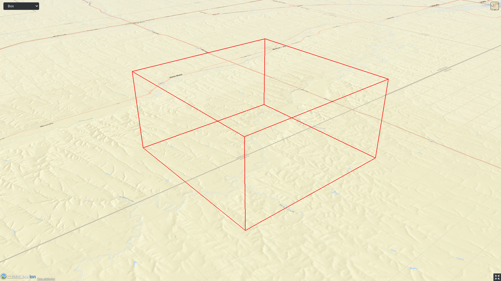
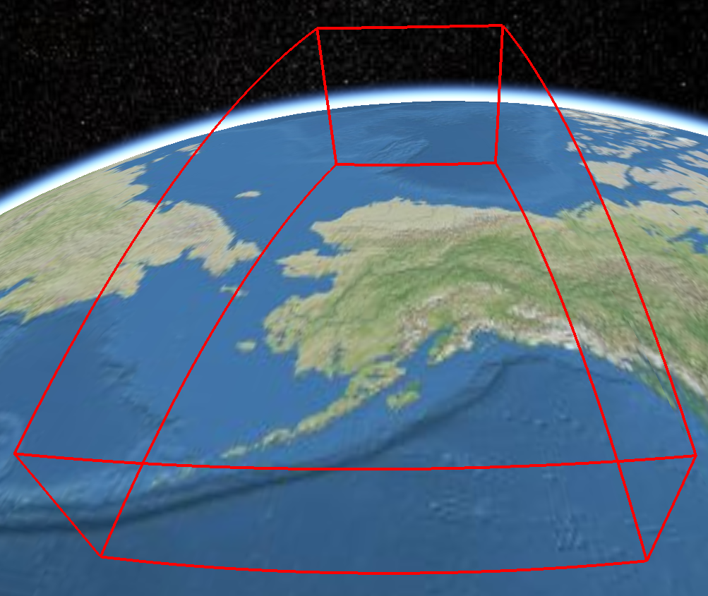
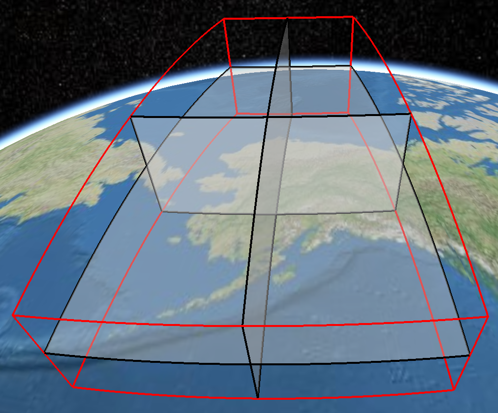
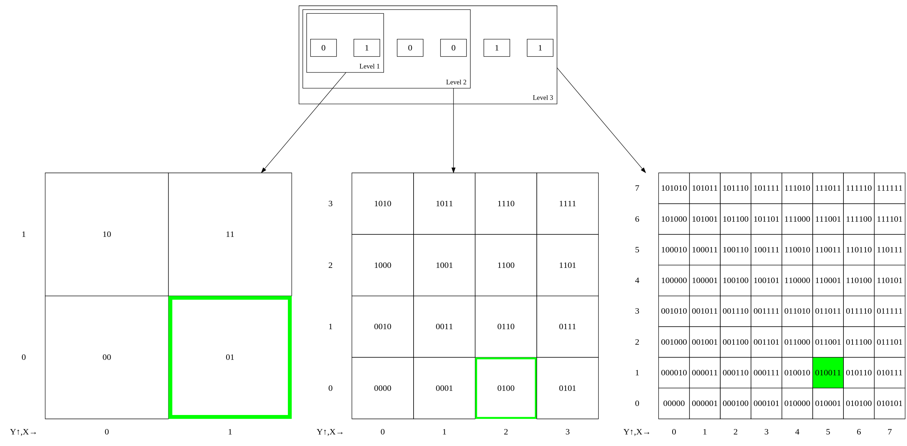

<!-- omit in toc -->
# 3DTILES_implicit_tiling

**Version 0.0.0**, TODO: Date

<!-- omit in toc -->
## Contributors

* Peter Gagliardi, Cesium
* Erixen Cruz, Cesium
* Sam Suhag, Cesium
* Sean Lilley, Cesium
* Josh Lawrence, Cesium
* Patrick Cozzi, Cesium
* Shehzan Mohammed, Cesium

<!-- omit in toc -->
## Status

Draft

<!-- omit in toc -->
## Dependencies

Written against the 3D Tiles 1.0 specification.

<!-- omit in toc -->
## Optional vs. Required

This extension is required, meaning that it must be listed in
both the `extensionsUsed` and `extensionsRequired` arrays of the
tileset JSON.

<!-- omit in toc -->
## Contents

- [Overview](#overview)
- [Use Cases](#use-cases)
- [Tileset JSON](#tileset-json)
- [Subdivision scheme](#subdivision-scheme)
  - [Implicit Subdivision](#implicit-subdivision)
- [Tile Coordinates](#tile-coordinates)
- [Template URIs](#template-uris)
- [Subtrees](#subtrees)
  - [Availability](#availability)
  - [Tile Availability](#tile-availability)
  - [Content Availability](#content-availability)
  - [Child Subtree Availability](#child-subtree-availability)
- [Subtree Files](#subtree-files)
  - [Buffers and Buffer Views](#buffers-and-buffer-views)
  - [Availability Packing](#availability-packing)
- [Glossary](#glossary)
- [Examples](#examples)
- [JSON Schema Reference](#json-schema-reference)
- [Appendix A: Availability Indexing](#appendix-a-availability-indexing)
  - [Definitions](#definitions)
  - [Availability Lengths](#availability-lengths)
  - [Converting Between Tile Coordinates and Morton Index](#converting-between-tile-coordinates-and-morton-index)
  - [Finding Adjacent Nodes](#finding-adjacent-nodes)
  - [Global and Local Tile Coordinates](#global-and-local-tile-coordinates)
  - [Morton Order Example](#morton-order-example)
  - [Morton Indexing Formulas](#morton-indexing-formulas)
- [Appendix B: Availability Formulas](#appendix-b-availability-formulas)
  - [Tile and Content Availability Formulas](#tile-and-content-availability-formulas)
  - [Child Subtree Availability Formulas](#child-subtree-availability-formulas)

## Overview

TODO: Rewrite this

**Implicit tiling** describes a Cesium 3D Tileset while enabling new data structures and algorithms for near constant time random access and dynamic tileset generation. It makes fast, efficient high resolution (meter or centimeter scale) global dataset streaming possible. The tileset is uniformly subdivided and organized for ease of read and write without the need to read the entire tileset at once. The subdivision, using full and sparse quad and octrees, enables random access, smaller tileset JSON files, and faster loading.

Implicit tiling provides a method for accessing tiles by tile coordinates. This allows for abbreviated tree traversal algorithms.


For a complete list of terminology used, see the [Glossary](#glossary).

## Use Cases

_This section is non-normative_

TODO: add a note about spatial queries.

Implicit tiling allows Cesium 3D Tiles to support a variety of new use cases.

A key use for implicit tiling is enabling and/or accelerating tree traversal algorithms. Accessing a tile by coordinates is faster than traversing the entire tree. Likewise, raycasting algorithms and GIS algorithms can benefit from the abbreviated tree traversals. Tiles can be loaded immediately instead of going from top to bottom of a tree.

Implicit tiling also allows for better interoperability with existing GIS data formats with implicitly defined tiling schemes. Some examples are:

* [CDB](https://docs.opengeospatial.org/is/15-113r5/15-113r5.html)
* [S2](http://s2geometry.io/)
* [WMTS](https://www.ogc.org/standards/wmts)
* [TMS](https://wiki.osgeo.org/wiki/Tile_Map_Service_Specification)

Implicit tiling enables procedurally-generated tilesets. Instead of serving static files, a server could extract the tile coordinates from [Template URIs](#template-uris) and generate tiles at runtime while using little disk space.

## Tileset JSON

The `3DTILES_implicit_tiling` extension may be defined on any tile in the tileset JSON file. Such a tile is called an **implicit root tile**, to distinguish it from the root node of the tileset JSON. The implicit root tile must not define the `children` property.

```json
{
  "asset": {
    "version": "1.0"
  },
  "geometricError": 10000,
  "extensionsUsed": [
    "3DTILES_implicit_tiling",
  ],
  "extensionsRequired": [
    "3DTILES_implicit_tiling",
  ],
  "root": {
    "boundingVolume": {
      "region": [-1.318, 0.697, -1.319, 0.698, 0, 20]
    },
    "refine": "REPLACE",
    "geometricError": 5000,
    "content": {
      "uri": "content/{level}/{x}/{y}.b3dm"
    },
    "extensions": {
      "3DTILES_implicit_tiling": {
        "subdivisionScheme": "QUADTREE",
        "subtreeLevels": 7,
        "maximumLevel": 20,
        "subtrees": {
          "uri": "subtrees/{level}/{x}/{y}.subtree"
        }
      }
    }
  }
}
```

In the extension object of the tileset JSON, the following properties about the root tile are included:

| Property | Description |
| ------ | ----------- |
| `subdivisionScheme` | Either `QUADTREE` or `OCTREE` |
| `subtreeLevels` | How many levels there are in each subtree |
| `maximumLevel` | Level of the deepest available tile in the tree. |
| `subtrees` | Template URI for subtree files. See [Subtrees](#subtrees) |

[Template URIs](#template-uris) are used for locating subtree files as well as tile contents. For content, the template URI is specified in the tile's `content.uri` property.

## Subdivision scheme

A **subdivision scheme** is a recursive pattern for dividing a bounding volume of a tile into smaller children tiles that take up the same space.

A subdivision scheme recursively subdivides a volume by splitting it at the midpoint of some or all of the dimensions. If the `x` and `y` dimensions are split, a quadtree is produced. If all three dimensions are split, an octree is produced. The subdivision scheme remains constant throughout the entire tileset.

For a `region` bounding volume, `x`, `y`, and `z` refer to `longitude`, `latitude`, and `height` respectively.

A **quadtree** divides space only on the `x` and `y` dimensions. It divides each tile into 4 smaller tiles where the `x` and `y` dimensions are halved. The quadtree `z` minimum and maximum remain unchanged. The resulting tree has 4 children per tile.


An **octree** divides space along all 3 dimensions. It divides each tile into 8 smaller tiles where each dimension is halved. The resulting tree has 8 children per tile.


The following diagrams illustrate the subdivision in the bounding volume types supported by 3D Tiles:

| Root Box | Quadtree | Octree |
|:---:|:--:|:--:|
|  |  |   |

TODO: make new region diagrams with more exaggerated curved bounding boxes
| Root Region | Quadtree | Octree |
|:---:|:--:|:--:|
|  |  |   |
The `region` boxes above are curved to follow the globe's surface.

### Implicit Subdivision

Implicit tiling only requires defining the subdivision scheme, refine strategy, bounding volume, and geometric error at the implicit root tile. These properties are computed automatically for any descendant tile based on the following rules:

| Property | Subdivision Rule | 
| --- | --- |
| `subdivisionScheme` | Constant for all descendant tiles |
| `refine` | Constant for all descendant tiles |
| `boundingVolume` | If `subdivisionScheme` is `QUADTREE`, each parent tile is divided into four child tiles. If `subdivisionScheme` is `OCTREE`, each parent tile is divided into eight child tiles. |
| `geometricError` | Each child's `geometricError` is half of its parent's `geometricError` |

## Tile Coordinates

**Tile coordinates** are a tuple of integers that uniquely identify a tile. Tile coordinates are either `(level, x, y)` for quadtrees or `(level, x, y, z)` for octrees. All tile coordinates are 0-indexed.

`level` is 0 for the implicit root tile. This tile's children are at level 1, and so on.

`x`, `y`, and `z` coordinates define the location of the tile within the level.

For `box` bounding volumes:

| Coordinate | Positive Direction |
| --- | --- |
| `x` | Along the `+x` axis of the bounding box |
| `y` | Along the `+y` axis of the bounding box |
| `z` | Along the `+z` axis of the bounding box |


For `region` bounding volumes:

| Coordinate | Positive Direction |
|---|---|
| `x` | From west to east (increasing longitude) |
| `y` | From south to north (increasing latitude) |
| `z` | From bottom to top (increasing height) |


## Template URIs

A **Template URI** is a URI pattern used to refer to tiles by their tile coordinates.

Template URIs must include the variables `{level}`, `{x}`, `{y}`. Template URIs for octrees must also include `{z}`. When referring to a specific tile, the tile's coordinates are substituted in for these variables.

Here are some examples of template URIs and files that they match:

```
== Quadtree Example ==
Pattern: "content/{level}/{x}/{y}.pnts"
Valid filenames: 
- content/0/0/0.pnts
- content/1/1/0.pnts
- content/3/2/2.pnts

== Octree Example ==
Pattern: "content/{level}/{x}/{y}/{z}.b3dm"
Valid filenames:
- content/0/0/0/0.b3dm
- content/1/1/1/1.b3dm
- content/3/2/1/0.b3dm
```

Unless otherwise specified, template URIs are resolved relative to the tileset JSON file.


## Subtrees

In order to support sparse datasets, additional information is needed to indicate which tiles or contents exist. This is called **availability**.

**Subtrees** are fixed size sections of the tileset tree used for storing availability. The tileset is partitioned into subtrees to bound the size of each availability object for optimal network transfer and caching. The `subtreeLevels` property defines the number of levels in each subtree. The subdivision scheme determines the number of children per tile.


After partitioning a tileset into subtrees, the result is a tree of subtrees.


### Availability

Each subtree contains tile availability, content availability, and child subtree availability.

* **Tile availability** indicates which tiles exist within the subtree
* **Content availability** indicates which tiles have associated content resources
* **Child subtree availability** indicates what subtrees are reachable from this subtree

Each type of availability is represented as a separate bitstream. Each bitstream is a 1D array where each element represents a node in the quadtree or octree. A 1 bit indicates that the tile/content/child subtree is available, while a 0 bit indicates that the tile/content/child subtree is unavailable. Alternatively, if all the bits in a bitstream are the same, a single constant value can be used instead.

To form the 1D bitstream, the tiles are ordered with the following rules:

* Within each level of the subtree, the tiles are ordered using the [Morton Z-order curve](https://en.wikipedia.org/wiki/Z-order_curve).
* The bits for each level are concatenated into a single bitstream


In the diagram above, colored cells represent 1 bits, grey cells represent 0 bits.

Storing tiles in Morton order provides these benefits:

- Efficient indexing - The Morton index for a tile is computed in constant time by interleaving bits.
- Efficient traversal - The Morton index for a parent or child tile are computed in constant time by removing or adding bits, respectively.
- Locality of reference - Consecutive tiles are near to each other in 3D space.

For more detailed information about working with Morton indices and availability bitstreams, see [Appendix A: Availability Indexing](#appendix-a-availability-indexing)

### Tile Availability

Tile availability determines which tiles exist in a subtree.

Tile availability has the following restrictions:

* If a non-root tile's availability is 1, its parent tile's availability must also be 1. 
* A subtree must have at least one available tile. 

TODO: Better diagram


### Content Availability

Content availability determines which tiles have a content resource. The content resource is located using the `content.uri` template URI.

Content availability has the following restrictions:

* If content availability is 1 its corresponding tile availability must also be 1. Otherwise, it would be possible to specify content files that are not reachable by the tiles of the tileset. 
* If content availability is 0 and its corresponding tile availability is 1 then the tile is considered to be an empty tile.
* When a subtree has at least one tile with content, content availability is required. If no tile in the subtree has content, then content availability is disallowed.

TODO: Better diagram


### Child Subtree Availability

Child subtree availability determines which subtrees are reachable from the deepest level of this subtree. This links subtrees together to form a tree.

Unlike tile and content availability, which store bits for every level in the subtree, child subtree availability only stores bits for a single level of nodes. These nodes are one level deeper than the deepest level of the subtree, and represent the root nodes of adjacent subtrees. This is used to determine which other subtrees are reachable before making network requests. 

TODO: better diagram


If availability is 0 for all child subtrees, then the tileset does not subdivide further.

## Subtree Files

A **subtree file** is a binary file that contains availability information for a single subtree. It includes two main portions:

* The **subtree JSON** chunk which describes how the availability data is stored.
* A binary chunk for storing availability bitstreams as needed.

Subtrees are stored in little-endian. A subtree file consists of a 24-byte header and a variable length payload: 


Header fields:

| Bytes | Field | Type     | Description |
|-------|-------|----------|-------------|
| 0-3   | Magic | `uint32_t` | A magic number identifying this as a subtree file. This is always `0x74627573` which when stored in little-endian is the ASCII string `subt` |
| 4-7   | Version | `uint32_t` | The version number. Always `1` for this version of the specification. |
| 8-15  | JSON byte length | `uint64_t` | The length of the subtree JSON, including any padding. |
| 16-23 | Binary byte length | `uint64_t` | The length of the buffer (or 0 if the buffer does not exist) including any padding. |

Each chunk must be padded so it ends on an 8-byte boundary:

* The JSON chunk must be padded at the end with spaces (`' '` = 0x20 in ASCII)
* If it exists, the binary chunk must be padded at the end with NUL bytes (`\x00` = 0x00 in ASCII)

The subtree JSON describes where the availability information for a single subtree is stored. Availability bitstreams are stored in buffers and accessed through buffer views.

### Buffers and Buffer Views

A **buffer** is a binary blob. A single buffer can be stored within the binary chunk of a subtree file. In all other cases, the binary file is assumed to be an external resource specified by the `uri` property. Each buffer has a `byteLength` describing the size of the data, including any padding (for subtree binary files)

A **buffer view** is a contiguous subset of a buffer. A buffer view's `buffer` property is an integer index to identify the buffer. A buffer view has a `byteOffset` and a `byteLength` to describe the range of bytes within the buffer. The `byteLength` does not include any padding. There may be multiple buffer views referencing a single buffer.

For efficient memory access, the `byteOffset` of a buffer view must be aligned to a multiple of 8 bytes.

TODO: Determine byte length
```json
{
  "buffers": [
    {
      "name": "Internal Buffer",
      "byteLength": 4
    },
    {
      "name": "External Buffer",
      "uri": "external.bin",
      "byteLength": 8
    }
  ],
  "bufferViews": [
    {
      "buffer": 0,
      "byteOffset": 0,
      "byteLength": 1
    },
    {
      "buffer": 0,
      "byteOffset": 1,
      "byteLength": 1
    },
    {
      "buffer": 0,
      "byteOffset": 2,
      "byteLength": 2
    }
  ],
  "tileAvailability": {
    "bufferView": 0
  },
  "contentAvailability": {
    "bufferView": 1
  },
  "childSubtreeAvailability": {
    "bufferView": 2
  }
}
```

### Availability Packing

Availability bitstreams are packed in binary using the format described in the [Boolean Data section](https://github.com/CesiumGS/3d-tiles/blob/3d-tiles-next/specification/Metadata/0.0.0/README.md#boolean-data) of the Cesium 3D Metadata Specification.

## Glossary

* **availability** - Data specifying which tiles/contents/child subtrees exist within a single subtree.
* **bitstream** - A boolean array stored as a sequence of bits rather than bytes.
* **bounding volume** - The spatial extent enclosing a tile or a tile's content, as defined in the [3D Tiles specification](https://github.com/CesiumGS/3d-tiles/tree/master/specification#bounding-volumes).
* **child subtree** - A subtree reachable from an available tile in the bottommost row of a subtree.
* **content** - A content such as Batched 3D Model or Point Cloud as defined in the [3D Tiles specification](https://github.com/CesiumGS/3d-tiles/tree/master/specification#introduction)
* **implicit tiling** - Describing a tileset using recursive subdivision.
* **implicit root tile** - A tile with the `3DTILES_implicit_tiling` extension, which denotes the root of an implicit ti
* **octree** - A 3D subdivision scheme that divides each bounding volume into 8 smaller bounding volumes along the midpoint of the `x`, `y`, and `z` axes.
* **quadtree** - A 2D subdivision scheme that divides each bounding volume into 4 smaller bounding volume along the midpoint of the `x` and `y` axes.
* **subtree** - A fixed-size section of the tileset tree used to break large tilesets into manageable pieces.
* **subtree file** - A binary file storing information about a specific subtree.
* **subdivision scheme** - A recursive pattern of dividing a parent tile into smaller children tiles occupying the same area. This is done by uniformly dividing the bounding volume of the parent tile.
* **template URI** - A URI pattern containing tile coordinates for directly addressing tiles.
* **tile** - A division of space that may contain content.
* **tileset** - A hierarchical collection of tiles.
* **tileset JSON** - A JSON file describing a tileset, as defined in the [Cesium 3D Tiles 1.0 specification](https://github.com/CesiumGS/3d-tiles/tree/master/specification#tileset-json).

## Examples

Examples can be found in the [examples folder](./examples/).

## JSON Schema Reference

OUTLINE:
- Generate via Wetzel

## Appendix A: Availability Indexing

### Definitions

In the sections below, the following variables are used to generalize between
quadtrees and octrees.

| Variable | Value | Description |
|----------|-------|-------------|
| `branchingFactor` | 4 or 8 | Number of children per node. 4 for quadtrees and 8 for octrees |  
| `bitsPerLevel` | 2 or 3 | Bits per level in Morton index. 2 for quadtrees and 3 for octrees |

### Availability Lengths

TODO

### Converting Between Tile Coordinates and Morton Index

TODO

### Finding Adjacent Nodes

TODO

### Global and Local Tile Coordinates

TODO

### Morton Order Example

_This section is non-normative_

The figure below shows the tile coordinate decomposition of the tile `(level, x, y) = (3, 5, 1)`. We first convert the tile coordinate to its Morton index. `5` represented as 3 bits is `101`. `1` represented as 3 bits is `001`. Interleaving the two, we get `010011`, which is `19`. 

At Level 3 of a Quadtree, we'll use 6 bits to represent the binary value of the Morton index: `010011`.



### Morton Indexing Formulas

| Quantity | Formula | Description |
| -------- | ------- | ----------- |
| `N` | 4 or 8 | N is 4 for quadtrees, 8 for octrees |
| `bits` | `log2(N)` | Quadtree address are a multiple of 2 bits, Octrees use a multiple of 3 bits | 
| `mortonIndex` | `interleave(z, y, x)` or `interleave(y, x)` | The morton index is computed by interleaving bits. See below. |
| `length(mortonIndex)` | `level * bits` | Length of morton index in bits
| `parent.mortonIndex` | `child.mortonIndex >> bits` | The parent morton index is a prefix of the child |
| `child[k].mortonIndex` | `(parent.mortonIndex << bits) + k` | Morton index of a node's `k-th` child in Morton order |
| `parent.indexOf(child)` | `child.mortonIndex % N` or `child.mortonIndex & (N - 1)` | Index of the child within the parent's `N` children |

TODO: Figure if this is correct
// I think these are equivalent?
localX = globalX % (2^localLevel)
localX = globalX & ((1 << localLevel) - 1);

The `interleave(a, b, c, ...)` function mentioned above interleaves the bits of the input streams into a single bit stream. It does this by taking a bit from each bit stream from left to light and concatenating them into a single bitstream. This is repeated until all bits have been used.

Below are some examples:

```
interleave(0b11, 0b00) = 0b1010
interleave(0b1010, 0b0011) = 0b10001101
interleave(0b0110, 0b0101) = 0b00111001

interleave(0b001, 0b010, 0b100) = 0b001010100
interleave(0b111, 0b000, 0b111) = 0b101101101
```

## Appendix B: Availability Formulas

### Tile and Content Availability Formulas

Both tile and content availability are stored in a bitstream with the same structure, so these formulas apply equally well to both

| Quantity | Formula | Description |
| -------- | ------- | ----------- |
| `lengthBits` | `(N^subtreeLevels - 1)/(N - 1)` | Length of buffer is determined by subtree levels |
| `lengthBytes` | `ceil(lengthBits / 8)` | Bytes needed to store the buffer | 
| `parent.index` | `floor((child.index - 1) / N)` | Index of the parent in the bitstream | 
| `parent.indexOf(child)` | `(child.index - 1) % N` | Index of the child within the parent's `N` children |
| `parent.children[k].index` | `N * index + k + 1` | Find the bit of the `k-th` child of a node |
| `index` | `(N^level - 1)/(N - 1) + mortonIndex` | Find the index of a node from `(level, mortonIndex)`
| `level` | `ceil(log(index + 1)/log(N))` | Find the level of a node relative to the subtree |
| `globalLevel` | `level + subtreeRoot.globalLevel` | Find the level of a node relative to the entire tileset | 
| `startOfLevel` | `(N^level - 1)/(N - 1)` | First index at a particular level (relative to the subtree root) |
| `mortonIndex` | `index - startOfLevel` | Convert from bit index to Morton index, relative to the root of the subtree |
| `globalMortonIndex` | `concat(subtreeRoot.globalMortonIndex, mortonIndex)` | Get the Morton index relative to the root of the tileset |  

### Child Subtree Availability Formulas

| Quantity | Formula | Description |
| -------- | ------- | ----------- |
| `lengthBits` | `N^subtreeLevels` | Length of the buffer by subtree levels |
| `lengthBytes` | `ceil(lengthBits / 8)` | Bytes needed to store the buffer |
| `childSubtree.globalLevel` | `subtreeRoot.globalLevel + subtreeLevels` | Level of the child subtrees relative to the tileset root |
| `leaf.children[k].index` | `N * leaf.mortonIndex + k` | Index of the `k-th` child subtree |
| `leaf.indexOf(childSubtree)` | `subtreeRoot.mortonIndex % N` | Index of the child subtree within the parent leaf's `N` children |
| `leaf.mortonIndex` | `floor(subtreeRoot.mortonIndex / N)` | Morton index of the parent leaf |
